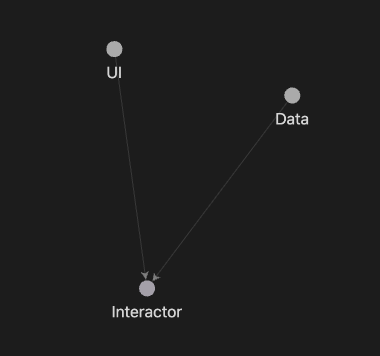
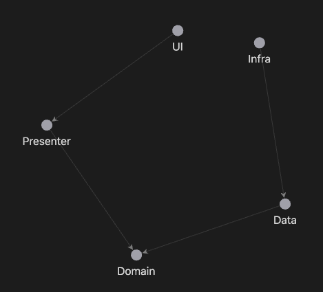

# MiniCore Arch Example

**Available in English 🇺🇸 and Portuguese 🇧🇷**

🇺🇸

This repository is based on the original project [mini_core_example](https://github.com/viniciusddrft/mini_core_exemple) by [Vinícius](https://github.com/viniciusddrft), with enhancements and new features.

**MiniCore Arch** is an innovative approach created by the **Flutterando** community, based on **Clean Architecture**, designed to provide a simple yet robust way to structure Flutter projects. This project serves as a practical example of how to efficiently organize your code, reducing complexity without compromising quality and scalability.

---

## Official Documentation

Check out the official documentation for more details about MiniCore Arch:  
[MiniCore Arch on GitHub](https://github.com/Flutterando/minicore)

---

## 🚀 **Getting Started with MiniCore Arch**

Follow the steps below to explore this example:

1. **Clone the repository**:

   ```bash
   git clone https://github.com/FlutterConcepts/minicore_arch.git
   ```

2. **Open the project in VSCode**.

3. **Run the project or tests**:
   - Press `F5` to execute all tests or start the Flutter Web project.

## **Core Explanation of Each Module**

### **Layer Structure and Relationships**

- **Main**:

  - Serves as the entry point of the application and knows all layers.
  - Responsible for initializing dependencies and connecting modules.

- **UI (User Interface)**:

  - Depends exclusively on the **Interactor** layer to execute business logic.
  - Does not interact directly with the **Data** layer, ensuring responsibility isolation.

- **Interactor (Business Logic Layer)**:

  - Acts as the intermediary between **UI** and **Data** layers.
  - Centralizes business rules, keeping them decoupled from other layers.
  - Does not have direct dependencies on any other layer.

- **Data (Data Layer)**:
  - Responsible for accessing external data sources, such as APIs, databases, or local services.
  - Depends on the **Interactor** layer to understand which data to provide or persist.
  - Does not interact directly with the **UI** layer, ensuring that presentation logic remains independent.

### MiniCore Architecture Data Flow Diagram:



### Clean Architecture Data Flow Diagram:



---

### **General Communication Flow**

1. The **UI (User Interface)** sends a request to the **Interactor** to initiate an operation.
2. The **Interactor (Business Logic)** processes the request and decides what action to take.
3. The **Interactor** requests the necessary data from the **Data (Data Layer)**, which performs operations like API calls or database queries.
4. The **Data** layer returns the results to the **Interactor**, which processes the raw data and transforms it into meaningful information.
5. The **Interactor** returns the final state or processed data to the **UI**, which presents it to the user.

---

### **Simplified Visualization**

```
Main (Entry Point)
│
├── UI (User Interface)
│      ↓
│  Interactor (Business Logic)
│      ↑
├── Data (Data Layer)
```

---

### **Key Responsibilities**

- **Main**:

  - Manages dependency creation and injection.
  - Connects layers in an orderly manner.

- **UI**:

  - Focuses only on presentation and user interaction.
  - Does not contain business logic or directly handle raw data.

- **Interactor**:

  - Centralizes all business logic, ensuring separation of concerns.
  - Prevents direct dependencies between the **UI** and **Data** layers.

- **Data**:
  - Exclusively handles data storage, retrieval, and persistence operations.
  - Ensures data manipulation is abstracted and modular.

---

## 💡 **How to Contribute**

Contributions are very welcome! Feel free to suggest improvements, report issues, or propose new features.

- Open an **issue** to discuss ideas.
- Submit a **pull request** to share your contributions with the community.

---

🇧🇷

Este repositório é baseado no projeto original [mini_core_example](https://github.com/viniciusddrft/mini_core_exemple) de [Vinícius](https://github.com/viniciusddrft), com aprimoramentos e novas funcionalidades.

**MiniCore Arch** é uma abordagem inovadora criada pela comunidade do **Flutterando**, baseada no **Clean Architecture**, com o objetivo de oferecer uma maneira simples e robusta de estruturar projetos Flutter. Este projeto é um exemplo prático que demonstra como organizar seu código de forma eficiente, reduzindo a complexidade sem comprometer a qualidade e a escalabilidade.

---

## Documentação Oficial

Acesse a documentação oficial para mais detalhes sobre o MiniCore Arch:  
[MiniCore Arch no GitHub](https://github.com/Flutterando/minicore)

---

## 🚀 **Começando com o MiniCore Arch**

Siga os passos abaixo para começar a explorar este exemplo:

1. **Clone o repositório**:

   ```bash
   git clone https://github.com/FlutterConcepts/minicore_arch.git
   ```

2. **Abra o projeto no VSCode**.

3. **Execute o projeto ou os testes**:
   - Pressione `F5` para rodar todos os testes ou iniciar o projeto Flutter Web.

## **Explicação do Core de Cada Módulo**

### **Estrutura de Camadas e Relacionamentos**

- **Main**:

  - É o ponto de entrada da aplicação e conhece todas as camadas.
  - Responsável por inicializar as dependências e conectar os módulos.

- **UI (Interface do Usuário)**:

  - Depende exclusivamente da camada **Interactor** para executar a lógica de negócios.
  - Não interage diretamente com a camada **Data**, garantindo isolamento de responsabilidades.

- **Interactor (Camada de Lógica de Negócios)**:

  - Serve como intermediário entre a **UI** e a **Data**.
  - Centraliza as regras de negócio, mantendo-as desacopladas das outras camadas.
  - Não possui dependência direta de nenhuma camada.

- **Data (Camada de Dados)**:
  - Responsável por acessar fontes de dados externas, como APIs, bancos de dados ou serviços locais.
  - Depende da camada **Interactor** para entender quais dados fornecer ou persistir.
  - Não interage diretamente com a camada **UI**, assegurando que a lógica de apresentação seja independente.

### Diagrama do Fluxo de Dados MiniCore Architecture:


### Diagrama do Fluxo de Dados Clean Architecture:


---

### **Fluxo Geral de Comunicação**

1. **UI (Interface do Usuário)** faz uma solicitação à **Interactor** para iniciar uma operação.
2. **Interactor (Lógica de Negócios)** processa a solicitação e decide qual ação tomar.
3. **Interactor** solicita os dados necessários à **Data (Camada de Dados)**, que realiza operações como chamadas a APIs ou consultas em banco de dados.
4. **Data** retorna os resultados para a **Interactor**, que processa os dados brutos e os transforma em informações úteis.
5. **Interactor** retorna o estado final ou dados processados para a **UI**, que os apresenta ao usuário.

---

### **Visualização Simplificada**

```
Main (Ponto de Entrada)
│
├── UI (Interface do Usuário)
│      ↓
│    Interactor (Lógica de Negócios)
│      ↑
├── Data (Camada de Dados)
```

---

### **Responsabilidades Chave**

- **Main**:

  - Gerencia a criação e injeção de dependências.
  - Conecta as camadas de maneira ordenada.

- **UI**:

  - Focada apenas na apresentação e na interação com o usuário.
  - Não contém lógica de negócios nem manipula diretamente dados brutos.

- **Interactor**:

  - Centraliza toda a lógica de negócios, garantindo a separação de preocupações.
  - Evita que as camadas **UI** e **Data** tenham dependências diretas entre si.

- **Data**:
  - Responsável exclusivamente por operações de armazenamento, recuperação e persistência de dados.
  - Garante que a manipulação de fontes de dados seja abstraída e modular.

---

## 💡 **Como Contribuir**

Contribuições são muito bem-vindas! Sinta-se à vontade para sugerir melhorias, reportar problemas ou propor novas funcionalidades.

- Abra uma **issue** para discutir ideias.
- Envie um **pull request** para compartilhar suas contribuições com a comunidade.

---

## Extras

🇺🇸

The term **"Interactor"** originates from English and can be understood as **"intermediary"** or **"interaction agent"**. In the context of software development, especially in architectures like **Clean Architecture** or **MVP**, the **Interactor** plays a significant role as **the layer responsible for the business logic of the application**.

---

### **Meaning and Function**

1. **Intermediary between UI and Data**:

   - It connects the **UI (User Interface)** layer to the **Data** layer (which handles external sources like APIs or databases).
   - Its main function is to **ensure that business logic remains isolated** from other layers.

2. **Executes Business Rules**:

   - All necessary processing or validation before sending or receiving data occurs within the Interactor.
   - Example: calculating the total for a shopping cart, validating user information, or deciding which data to fetch from an API.

3. **Decoupling**:
   - It shields the UI layer from directly knowing the Data layer and vice versa.
   - This promotes a cleaner, more modular design, making testing and maintenance easier.

---

### **Why the Name "Interactor"?**

The name "Interactor" refers to its primary role: **interacting with different parts of the system** (UI and Data) and acting as an intermediary between them, ensuring that business logic is applied correctly.

---

### **Practical Example**

Imagine an application that displays a car catalog:

- **UI**:

  - A "Fetch Car Brands" button is clicked.
  - The UI sends a request to the **Interactor**.

- **Interactor**:

  - Receives the request from the UI.
  - Decides to call the "Fetch Car Brands" use case.
  - Processes the result and returns it to the UI.

- **Data**:
  - The use case makes an API call or queries a database to retrieve the requested data.

---

### **Analogies**

- Think of the Interactor as the **brain** of the system. It makes decisions and coordinates how information flows between other parts.
- It’s also like a **translator**, ensuring that the UI and Data layers can communicate without knowing each other directly.

---

**In summary**: The Interactor is a fundamental layer for organizing and centralizing business logic, ensuring the system is modular, testable, and well-structured.

---

🇧🇷

O termo **"Interactor"** vem do inglês e pode ser entendido como **"intermediador"** ou **"agente de interação"**. No contexto de desenvolvimento de software, especialmente em arquiteturas como **Clean Architecture** ou **MVP**, o **Interactor** desempenha um papel importante como **a camada responsável pela lógica de negócios da aplicação**.

---

### **Significado e Função**

1. **Intermediador entre UI e Data**:

   - Ele conecta a camada de **UI (Interface do Usuário)** à camada de **Data** (que lida com fontes externas como APIs ou bancos de dados).
   - Sua principal função é **garantir que a lógica de negócios permaneça isolada** das outras camadas.

2. **Executa Regras de Negócio**:

   - Todo o processamento ou validação necessária antes de enviar ou receber dados ocorre no Interactor.
   - Exemplo: calcular o total de um carrinho de compras, validar informações do usuário, ou decidir qual dado buscar na API.

3. **Desacoplamento**:
   - Ele protege a camada de UI de conhecer diretamente a camada de Data e vice-versa.
   - Isso promove um design mais limpo e modular, facilitando testes e manutenções.

---

### **Por que o nome "Interactor"?**

O nome "Interactor" é uma referência à sua função principal: **interagir com diferentes partes do sistema** (UI e Data) e atuar como um intermediário entre elas, garantindo que a lógica de negócios seja aplicada corretamente.

---

### **Exemplo Prático**

Imagine um aplicativo que exibe um catálogo de carros:

- **UI**:

  - Um botão "Buscar marcas de carros" é clicado.
  - A UI envia uma solicitação para o **Interactor**.

- **Interactor**:

  - Recebe a solicitação da UI.
  - Decide chamar o caso de uso de "Buscar marcas de carros".
  - Processa o resultado e retorna para a UI.

- **Data**:
  - O caso de uso faz uma chamada à API ou consulta um banco de dados para obter os dados solicitados.

---

### **Analogias**

- Pense no Interactor como o **cérebro** do sistema. Ele toma decisões e coordena como as informações fluem entre as outras partes.
- Ele também é como um **tradutor**, garantindo que a UI e o Data possam se comunicar sem se conhecer diretamente.

---

**Em resumo**: O Interactor é uma camada fundamental para organizar e centralizar a lógica de negócios, garantindo que o sistema seja modular, testável e bem estruturado.
